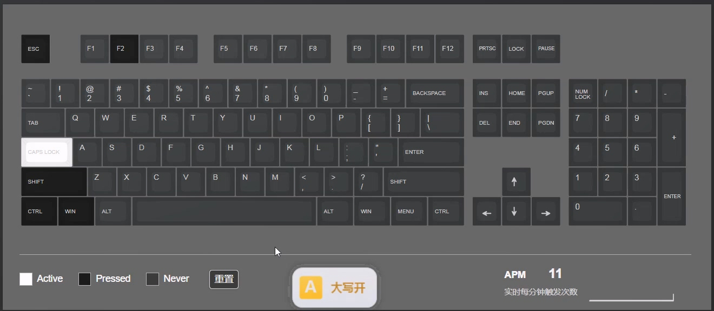
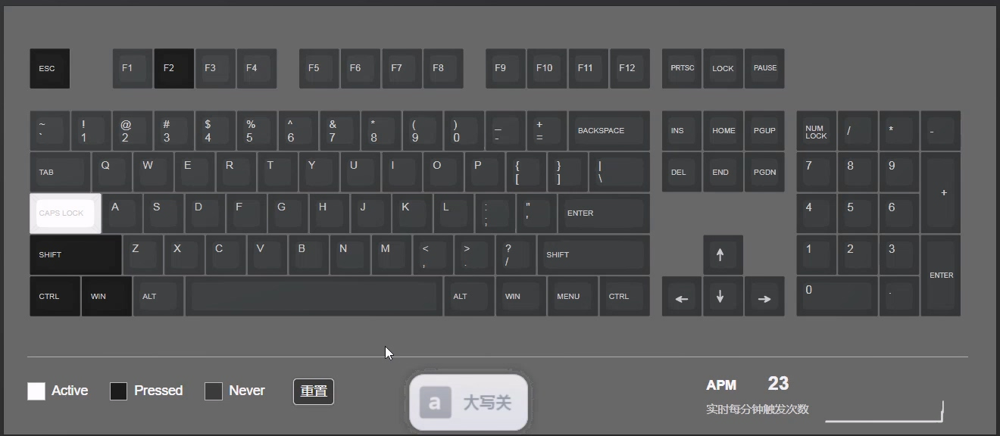
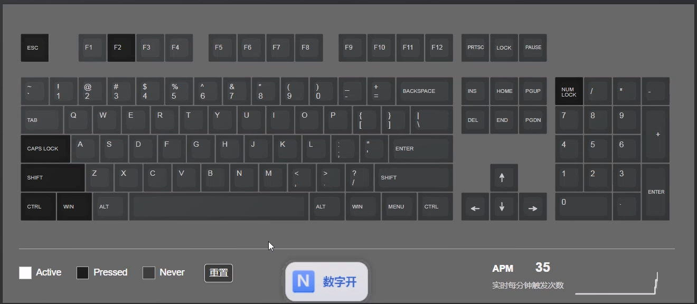
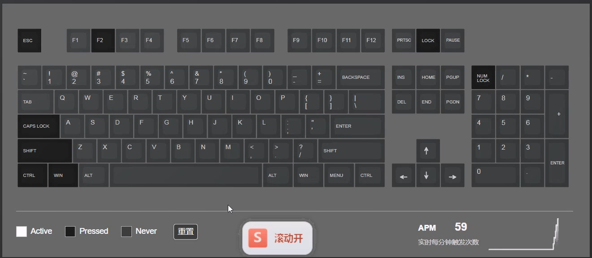
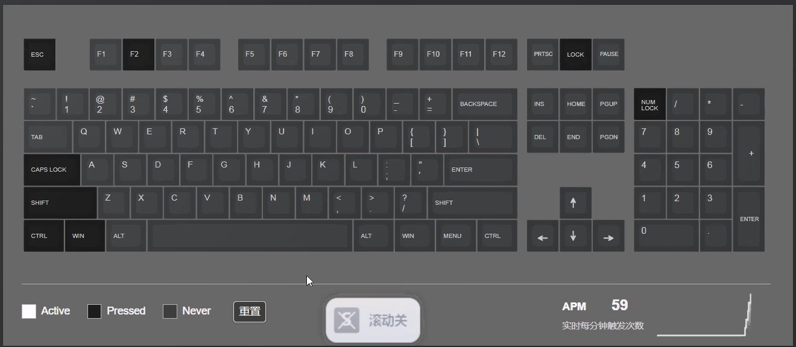
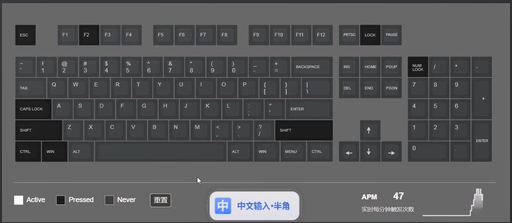
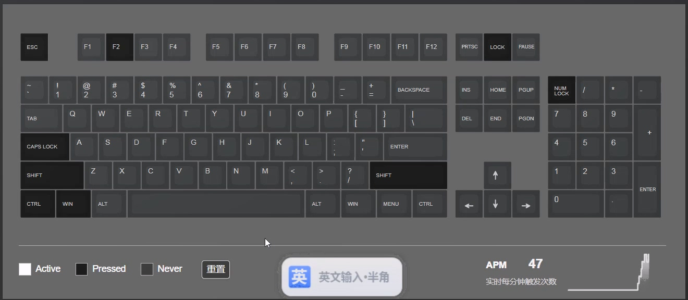

# LockOnScreen

键盘切换键状态提示工具 —— 按下 **Caps Lock / Num Lock / Scroll Lock** 时，在鼠标附近弹出当前开关状态气泡；**切换中/英文输入法时**同样弹出气泡提示，默认 0.8 秒后自动淡出（首次启动提示显示 1.2 秒）。

> **v2.0.0** 已发布：[功能总结与更新记录 CHANGELOG](CHANGELOG.md) · [GitHub Releases](https://github.com/mrdalin/LockOnScreen/releases)

## 功能

<video src="res/img/演示视频.mp4" width="640" controls muted></video>

<p align="center"><em>演示视频：按下 Caps/Num/Scroll 弹出状态气泡、切换中英文输入法弹出输入法气泡（480 KB，GitHub 仓库内）</em></p>

| 状态 | 截图 | 状态 | 截图 |
|---|---|---|---|
| Caps Lock 开 |  | Caps Lock 关 |  |
| Num Lock 开 |  | Num Lock 关 |  |
| Scroll Lock 开 |  | Scroll Lock 关 |  |
| 中文输入法 |  | 英文输入法 |  |

| 键 | 开 | 关 |
|---|---|---|
| Caps Lock | `A` 黄色 大写开 | `a` 灰色 大写关 |
| Num Lock | `N` 蓝色 数字开 | `N̶` 灰色 数字关（× 标记） |
| Scroll Lock | `S` 红色 滚动开 | `S̶` 灰色 滚动关（× 标记） |
| 输入法 | `中` 中文输入·全角/半角 | `英` 英文输入 |

（三键专属色圆角方块：Caps=黄 / Num=蓝 / Scroll=红，关状态统一中性灰并用白色 × 标记；输入法恒用主色蓝。文字颜色同步键色加深版）

- 后台运行，托盘图标常驻（右键菜单：开机自启 / 显示时长 / 透明度 / 显示设置 / 退出；双击托盘直达显示设置）
- **输入法状态检测**（v2 新增）：切换中/英文（全角/半角）时弹出气泡，支持微软拼音、搜狗、QQ、百度等主流中文输入法
  - **实时读取**（主通道，ImTip/aardio 方式）：每 30ms 轮询前台窗口，`WM_IME_CONTROL` 取转换模式按位判定——`(conv&3) 且无 NOCONVERSION(0x100)` 为中文、`conv&8` 为全角（实测 opened 通道在切换瞬间会抖动归零，故仅以 conv 位判定，与 ImTip 一致）；前台窗口或输入法切换时强制重读（解决「同一窗口切换输入法后提示相反」）
  - **文本输入场景过滤**：被动触发的输入法提示仅在前台窗口有输入光标（caret）时弹出——解压软件、看图器、文件管理器等无文本输入需求的窗口切到时不弹输入法气泡，避免频繁打扰；主动按 Shift/Ctrl+Space/Shift+Space 切换任何场景都反馈
  - **键盘钩子**（兜底）：`WH_KEYBOARD_LL` 捕获 Shift（中/英）、Ctrl+Space（中/英）、Shift+Space（全/半角）、Win+Space（语言）切换热键，读不到真实状态时按语义翻转即时弹气泡
  - 单独 Shift 需「按下 ≥160ms 且无其他键同按」才判定为中英切换，避免快速击键误判导致状态漂移
  - Win+Space 切换的是系统输入语言布局，不参与中英翻转（由 TSF 语言事件单独处理）
  - **TSF 事件通知**（Win8+）：注册 `ITfActiveLanguageProfileNotifySink`，切语言/切输入法即时触发强制重读
  - **IMM 兜底**（传统 Win32 应用）：`ImmGetConversionStatus` 双路径
- **多显示器适配**：气泡定位基于鼠标所在屏幕（跟随光标/屏幕正中/角落/屏幕边缘，互斥单选，默认跟随光标）
- **托盘图标与 Caps Lock 状态联动**：大写开=黄色 `A`，大写关=灰色 `a`，悬停提示同步显示
- 启动时自动显示一次 Caps Lock 当前状态提示
- OSD 气泡（Win11 Fluent 风格）：白色渐变 + 大圆角 + 柔和多层阴影 + 三键专属色图标；宽度按内容自适应；默认显示 0.8 秒后淡出（启动提示 1.2 秒）
- 开机自启：**以管理员身份运行** → 写入 `HKLM`（所有用户生效）；普通权限运行 → 写入 `HKCU`（当前用户生效）。值均为本 exe 完整路径
- 单文件、绿色免安装，可放任意目录运行（建议放固定位置，自启依赖路径）

## 使用

1. 双击 `LockOnScreen.exe` 即可运行（无窗口，托盘图标显示当前大小写状态：黄 A=开/灰 a=关）
2. 按 Caps / Num / Scroll 任意键，跟随鼠标弹出状态气泡（默认 0.8 秒后淡出；默认跟随鼠标显示）
3. 切换中/英文输入法（如 Shift、Ctrl+Space、Win+Space 或语言栏切换），弹出「中文输入·全角 / 英文输入·半角」气泡（可勾选取消，见下）；仅在文本输入场景（窗口内有输入光标）被动提示，避免解压/看图等非输入窗口打扰
4. 右键托盘图标：开机自启 / 显示时长（显示当前值，如「显示时长 (1.0s)」）/ 透明度（显示当前值）/ **显示设置** / 退出；**双击托盘图标**直接打开显示设置窗口
   - **显示设置**：集中调整显示位置（跟随鼠标/屏幕正中/角落/屏幕边缘，含角落/边缘下拉，点击下拉自动选中对应位置）、透明度（默认 100%）、显示时长（默认 0.8s）、显示项（Caps/Num/Scroll/输入法状态勾选）；**点选即保存**（每次修改立即生效并写入配置），确定=保存并关闭、关闭按钮=仅关闭
5. 配置自动保存到同目录 `LockOnScreen.ini`，同时写入 `HKCU\Software\LockOnScreen`（注册表兜底）

## 兼容性与体积

- 32 位单文件，Windows 7 / 10 / 11（32 位与 64 位均可）运行，仅依赖系统自带 DLL（含 GDI+，即 gdiplus.dll，Win7 自带）
- 成品单个 exe 约 205 KB（远小于 1 MB 限制）
- 输入法监测：实时读取前台窗口输入法状态（ImTip/aardio 方式，`WM_IME_CONTROL` 按位判定中英/全角）+ 键盘钩子热键翻转兜底（Shift/Ctrl+Space/Shift+Space/Win+Space）+ TSF 事件强制重读

## Win7 实机验证清单（本工具在 Win10 沙箱验证，以下建议在目标机器确认）

- [ ] Win7 32 位 / 64 位：双击运行、按键气泡显示正常
- [ ] Win7：切换输入法（微软拼音/搜狗等）弹出「中文/英文输入」气泡（IMM 兜底通道）
- [ ] Win10 / Win11：切换中/英即时弹出气泡（键盘钩子通道），全/半角切换显示「·全角/·半角」
- [ ] 管理员身份运行后，`HKLM\Software\Microsoft\Windows\CurrentVersion\Run` 出现 `LockOnScreen`，重启后自动启动
- [ ] 普通权限运行后，`HKCU\Software\Microsoft\Windows\CurrentVersion\Run` 出现对应值
- [ ] 托盘图标随 Caps Lock 状态变化（黄 A=开/灰 a=关，悬停文字同步）
- [ ] 托盘右键菜单：开机自启 / 显示时长 / 透明度 / 显示设置 / 退出均正常
- [ ] 启动时提示一次 Caps Lock 当前状态（大写开/大写关）
- [ ] 多显示器时气泡定位跟随鼠标所在屏幕（默认跟随光标，可切换正中/角落/屏幕边缘）

## 关于杀毒/SmartScreen 提示

本程序由官方 GCC 工具链干净编译，不加壳、不混淆、无注入等敏感行为，主流杀软一般不报。
Microsoft SmartScreen 对**无数字签名**的新程序仍可能提示「未知发布者 / 已阻止」，本项目已决定接受此现状，不再计划购买签名证书。

## 构建（可选）

需要 MinGW-w64（x86，GCC 16+，含 g++）与 PowerShell：

```bash
powershell -File scripts/make_ico.ps1   # 生成 res/app.ico（标准格式）
windres res/app.rc -O coff -o res/app.o
g++ -Wall -Wextra -O2 -mwindows -s -o dist/LockOnScreen.exe src/main.c res/app.o -lgdiplus -lmsctf -limm32 -lole32
```

> 说明：`-lmsctf`（TSF 输入法监测）、`-limm32`（IMM 兜底）、`-lole32`（COM 初始化）为 v2 新增链接库，均为系统自带。

## 目录结构

```
LockOnScreen/
├── src/main.c             # 全部源码（约 2460 行）
├── res/app.ico            # 应用图标（标准 ICO，由脚本生成）
├── res/app.rc             # 图标 + 版本资源
├── res/caps_on.ico        # 托盘黄 A（Caps 开）
├── res/caps_off.ico       # 托盘灰 a（Caps 关）
├── res/img/               # README 截图与演示视频
├── scripts/make_ico.ps1   # ICO 生成脚本
├── scripts/check_ico.ps1  # ICO 像素检查脚本
├── scripts/test_render.cpp # OSD 渲染验证工具
├── scripts/test_tsf.cpp   # TSF+IMM 输入法检测验证工具
├── scripts/test_ime_live.cpp # 实时输入法状态诊断（ImTip 方式，验证通道有效性）
├── CHANGELOG.md         # 版本更新记录
├── AGENTS.md            # Agent 规则文件
├── dist/                  # 成品 exe（git 忽略）
└── README.md
```
